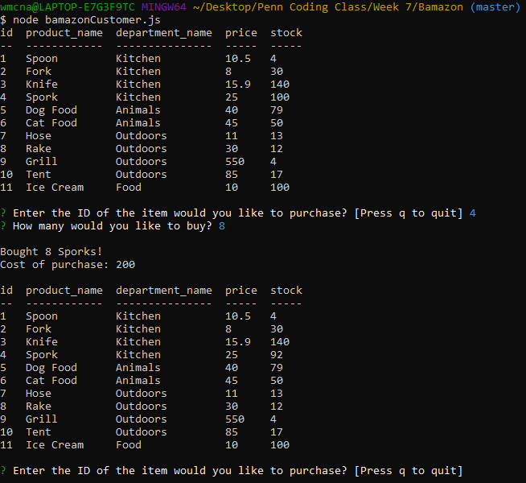
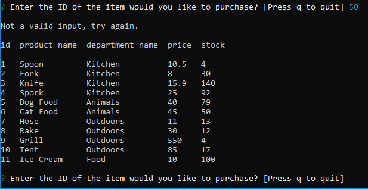
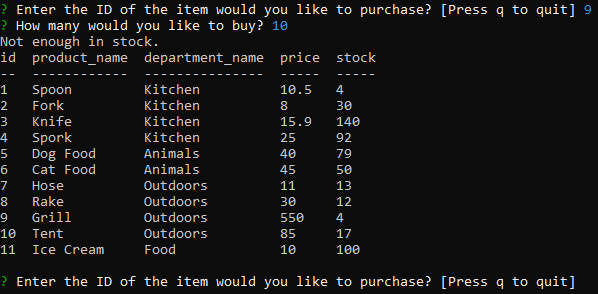
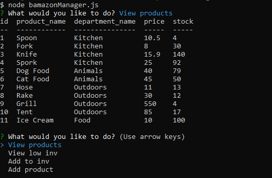
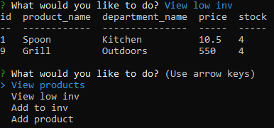
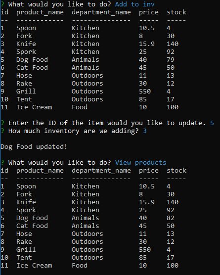
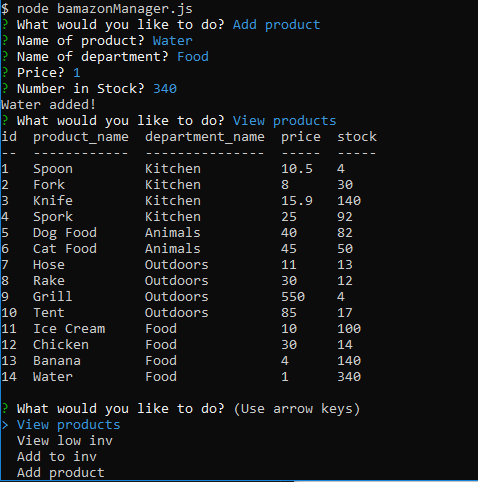

# Bamazon

This is a CLI app that takes information from a local SQL database and displays it to the terminal and allows the user to interact with the database through inquirer prompts. To run these files on your own computer, you would have to create your own sql database in mysql. In addition, after downloading you will need to run 'npm install' in the folder to download the necessary node modules.

## bamazonCustomer.js

Running this file in node allows the user to view and purchase items listed in the database.

When the user runs this program, they are shown the list of items in the database available for purchase. They select which item they want to purchase and the amount. If both entries are valid it returns a log of how many of the items were purchased and the total cost. It then updates the database and displays it in the console. The program then can run from the top again.

Above shows that if the ID is invalid it will deny it and repeat the program from the top.

Above shows that if the desired amount to purchase is above the stock then it will deny the request and repeat the process.

## bamazonManager.js

Running this file in node allows the user four different options via a prompt to select from to simulate the actions of a manager.
The choices of the prompt are:

* View Products for Sale
* View Low Inventory
* Add to Inventory
* Add New Product

Selecting the View Products option displays a table taken from the database similar to the customer program.

Selecting the View Low Inventory option displays only the items from the table that have a stock at 5 or lower.

Selecting the Add Inventory option allows the manager to select an item and add to it's stock. It has similar validation checks as to the customer program to only accept valid ids.

Selecting the Add Product option allows the manager to update the database with a new product.

